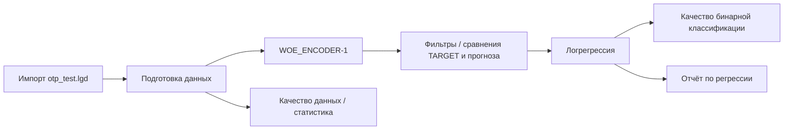

# Лабораторная работа 7 (Loginom): что происходит в сценарии

Документ описывает пакет **`7_f.lgp`**: из чего он собран, какие данные на входе, какие узлы идут друг за другом и зачем нужны внешние библиотеки (kits). Это не замена методичке, а «карта местности», чтобы ориентироваться в схеме.

---

## 1. Общая идея лабораторной

Сценарий относится к **моделированию отклика** (бинарная целевая переменная **`TARGET`**: отклик / не отклик) по данным клиентов. Типичная постановка в курсах по анализу данных:

1. загрузить таблицу с признаками и откликом;
2. **подготовить данные** (пропуски, отбор переменных, фильтры);
3. **закодировать категориальные признаки** числами, удобными для моделей (в твоём случае — **WOE-кодирование**);
4. обучить **логистическую регрессию** и посмотреть **качество классификации** и **отчёты**.

В Loginom всё это делается **цепочкой узлов** на схеме: выход одного узла подключается ко входу следующего.

---

## 2. Что лежит в папке с лабораторной

| Файл | Назначение |
|------|------------|
| **`7_f.lgp`** | Основной пакет Loginom со сценарием |
| **`otp_train.lgd`**, **`otp_test.lgd`** | Локальные наборы данных Loginom (часто train / test) |
| **`loginom_category_kit.lgp`** | Компоненты кодирования категорий (в т.ч. WOE Encoder из библиотеки Category Encoders в Python) |
| **`loginom_sklearn_kit.lgp`** | Компоненты вокруг **scikit-learn** (в т.ч. **simple.fitter** — универсальный «обучатель» модели из sklearn) |
| **`loginom_silver_kit.lgp`** | Общая вспомогательная библиотека Loginom Silver Kit |
| **`libs/python_kits/…`** *(если есть)* | Копии kit-пакетов по рекомендованной структуре размещения библиотек |

В самом **`7_f.lgp`** в сценарии явно задаётся импорт **`otp_test.lgd`** как источника данных для цепочки (имя узла совпадает с файлом). Файл **`otp_train.lgd`** обычно нужен для **обучения** на одной выборке и проверки на другой; если в схеме подключён только тестовый файл, обучение идёт именно по той таблице, которая реально связана с импортом.

---

## 3. Откуда берутся «ломаные связи» и ошибки вида sklearn kit / GUID

Пакет **не автономен**: узлы типа кодировщиков и **`simple.fitter`** — это не «нарисованные блоки», а **ссылки на компоненты из других `.lgp`**.

- **`loginom_category_kit`** зависит от **`loginom_sklearn_kit`** (внутри kit связаны **энкодеры → simple.fitter**).
- Если **`loginom_sklearn_kit.lgp`** нет рядом или Loginom не находит его по **`HintPath`**, при открытии пакета появляются сообщения вида «не восстановить ссылку», «не найден компонент GUID=…». После этого **связи между узлами в твоём сценарии тоже могут не восстановиться**.

**Имеет значение порядок:** все нужные `.lgp` должны лежать в **одной папке с `7_f.lgp`** (или пути в «Ссылки на пакеты» должны быть исправлены вручную в Loginom).

---

## 4. Какие узлы реально есть в сценарии (по структуре `7_f.lgp`)

Ниже — упорядоченный список **основных узлов с глобальным идентификатором** (это «настоящие» кирпичики схемы, без мелких портов вроде «Подключение»).

1. **Импорт данных** — **`otp_test.lgd`**
2. **`WOE_ENCODER-1`** — Python-узел: **WOE-кодирование** признаков (библиотека **`category_encoders`**, класс **`WOEEncoder`**). Колонки **`AGREEMENT_RK`** (идентификатор) и **`TARGET`** (целевая) в типичной реализации не кодируются как остальные признаки.
3. **IV-отбор (выполнение)** — этап, связанный с **отбором признаков по информационной ценности (IV)** в учебных сценариях Loginom (конкретные пороги и колонки задаются в настройках узла).
4. **Пропуски: …** — обработка **пропущенных значений** по перечисленным полям (часто замена, отфильтровывание и т.д.).
5. **Кон. классы: Отклик, Возраст** — работа с **конечными классами** / дискретизацией по целевой и возрасту (зависит от настроек узла).
6. Несколько узлов с названиями вроде **`TARGET, TARGET|Прогноз`**, **`TARGET, Отлик|Прогноз`** — как правило, это **фильтры** или **сравнение факта и прогноза** (в названиях встречаются опечатки «Отлик» вместо «Отклик» — это не влияет на смысл, это подписи на схеме).
7. **Логрегрессия: TARGET** — обучение **логистической регрессии** по целевой **`TARGET`**.
8. Узлы **«Логрегрессия: …»** с уточнением признаков — варианты модели с **другим набором входных колонок** после преобразований.
9. **Удаление, Изменение** — **преобразование структуры таблицы**: удаление/переименование столбцов, приведение к виду, удобному для следующих узлов.
10. **Качество данных** / **Статистика** — **диагностика** и сводки по таблице.
11. **Качество бинарной классификации** — метрики (точность, AUC и т.д. — что включено в узел).
12. **Отчёт по регрессии** — визуализация/таблицы по **регрессионной** постановке (в бинарной задаче логрегрессия формально остаётся регрессией вероятности).

Порядок **на экране** может отличаться от порядка **в списке** — в Loginom важны **стрелки (связи)** между выходом и входом.

---

## 5. Логика потока данных (упрощённая схема)

Текстом цепочка выглядит так:

```text
otp_test.lgd  →  [подготовка: пропуски, классы, IV-отбор …]  →  WOE_ENCODER-1
       →  [ещё преобразования / фильтры]  →  Логрегрессия  →  Прогноз / оценка качества  →  Отчёты
```

**WOE** (Weight of Evidence) — способ превратить категории (и иногда бины чисел) в **одно число на категорию**, отражающее «насколько эта категория чаще встречается при TARGET=1 vs 0». Это стандартный приём в **скоринге** и кредитном анализе; для дерева/леса иногда используют другие кодировки, но для **логрегрессии** WOE часто удобен.

Узлы **логрегрессии** в конце цепочки получают **уже подготовленную матрицу признаков** и строят модель, предсказывающую вероятность отклика.

---

## 6. Где здесь Python и sklearn

- Узел **`WOE_ENCODER-1`** — это **Python** внутри Loginom: нужны пакеты **`pandas`**, **`category_encoders`**, **`numpy`** в том интерпретаторе Python, который указан в настройках Loginom.
- Компоненты из **`loginom_sklearn_kit`** (в т.ч. **`simple.fitter`**) завязаны на **`scikit-learn`**: обучение и применение моделей sklearn из сценария без ручного кода (или с минимальным).

Если Python не настроен или библиотеки не установлены, узлы падают уже **на выполнении**, даже если связи на схеме целые.

---

## 7. Mermaid: ориентировочная блок-схема

Ниже — **логическая** схема (имена блоков совпадают с типичными подписями в пакете; точный порядок ветвлений смотри в Loginom по стрелкам).



---

## 8. Как читать схему в Loginom на практике

1. Найди **узел импорта** — от него «питание» всей цепочки.
2. Иди **по стрелкам от выхода набора данных** (`Набор данных` / `Выходной набор данных`) ко входу следующего узла.
3. Узлы **качества** и **отчётов** часто подключены **параллельно** к тому же потоку, что и модель — они **не обязаны** быть строго «последним» узлом в одну линию.
4. Если стрелка **оборвана** — у предыдущего узла нет выхода на вход следующего: либо связь не восстановилась после ошибки kit, либо узел удаляли/копировали пакет без зависимостей.

---

## 9. Краткий глоссарий

| Термин | Смысл |
|--------|--------|
| **Пакет (.lgp)** | Файл проекта Loginom со сценарием и ссылками на другие пакеты |
| **Kit** | Библиотека готовых узлов (категориальные кодировщики, sklearn и т.д.) |
| **Набор данных / таблица** | Табличный поток между узлами |
| **TARGET** | Целевая переменная (бинарный отклик) |
| **WOE** | Вес доказательства — числовая замена категорий по связи с TARGET |
| **simple.fitter** | Узел из sklearn kit: подбор и обучение sklearn-модели по входной таблице |
| **Логрегрессия** | Модель вероятности «класс 1» от линейной комбинации признаков |

---

## 10. Если снова «слетели связи»

Проверь по шагам:

1. В одной папке с **`7_f.lgp`** есть **`loginom_sklearn_kit.lgp`** и **`loginom_category_kit.lgp`**.
2. В Loginom в свойствах пакета / ссылках нет «битых» путей (особенно если папку переименовали).
3. Python в настройках Loginom указывает на интерпретатор, где стоят **`scikit-learn`**, **`category_encoders`**, **`pandas`**.

---

*Документ сгенерирован для папки `D:\ycheba_guap\БД\лр7`. При изменении сценария в Loginom нумерация и подписи узлов могут отличаться — перепроверяй по актуальной схеме.*
