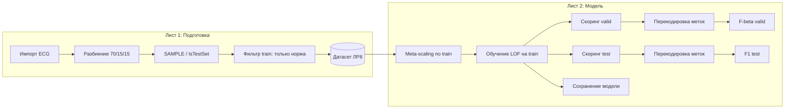

# Лабораторная работа 8 (ЛР8): что происходит в этом пакете Loginom

Документ объясняет **задачу**, **данные**, **два листа сценария** и **смысл блоков** без привязки к конкретной версии ваших путей и библиотек. Пакет называется `lr8_lof.lgp`: в нём воспроизводится методика обучения и оценки модели **обнаружения аномалий** на ЭКГ-сигналах с помощью **Local Outlier Factor (LOF)** из `sklearn`, в режиме **Novelty Detection**.

---

## 1. Зачем эта лаба (в одном абзаце)

Нужно построить модель, которая по признакам записи ЭКГ (**VAR2, VAR3, …**) решает: «это **норма** или **аномалия**?».  
Классический LOF сравнивает каждую точку с её соседями в пространстве признаков и выдаёт отклонение («насколько объект похож на выброс»). Режим **Novelty = True** означает: **модель обучают только на нормальных примерах**, а затем помечают как подозрительные те объекты (в том числе на valid/test), которые сильно отличаются от «облака» нормальных записей.

В методичке требуют разделить данные на **train / valid / test** (ориентировочно **70% / 15% / 15%**, общий генератор случайности `seed=42`), задать стобцы **SAMPLE** и **IsTestSet**, заранее **нормализовать** признаки (**Meta-scaling / z-score** под контроль train), подобрать гиперпараметры LOF (**число соседей k**, **contamination c**) по качеству на **valid**, а итоговую оценку дать по **test**.

---

## 2. Из чего состоит пакет (`lr8_lof.lgp`)

В Loginom один «проектный» файл — это **пакет** с одним или несколькими **листами** (units). Здесь логично два листа:

| Лист (условное имя) | Роль |
|---------------------|------|
| **Подготовка выборок** (`Unit_0`) | Импорт сырых файлов, разбиение, метки SAMPLE/IsTestSet, финальный общий набор данных **«ЛР8 / публичный датасет»** для второго листа. |
| **Построение модели** (`Unit_1`) | Ссылка на датасет с первого листа → масштабирование → обучение LOF на train → скоринг valid/test → приведение меток к виду метрик → **Fβ** на valid, **F1** на test и т.д. |

Визуально на втором листе вы видите крупный блок узлов посередине (meta-scaling, отбор SAMPLE, LOF, **три узла model.fitter** и т.д.) — это **одна связная методика**, а не три независимые «лабы».

---

## 3. Данные: что лежит в `ecg_train.txt` и `ecg_test.txt`

- Признаки — числовые колонки **VAR2 …** (агрегаты/характеристики сигнала).
- Метка **CLASS** задаёт истинный класс (в методичке норму и аномалии кодируют по-разному на разных этапах; в сценарии есть явные узлы **«Замена: CLASS»** и поясняющая подпись про перекодировку меток под метрики).
- Поле **OBJECT** (или аналог) — **идентификатор записи**; его обычно не подают в модель как признак совместно с таргетом, а исключают в настройках `ignore_fields` у `model.fitter`.
- После сборки общего набора каждая строка относится к одной из зон эксперимента: **train**, **valid** или **test** — это отражено в столбце **SAMPLE**. Флаг **IsTestSet** отделяет «тестовую» историю там, где это нужно по методичке.

Идея разбиения **70 / 15 / 15**:

1. Сначала из «большой» части исторически задают **train** и «хвост» для последующего valid+test (в сценарии это делается разбиением 70/30 и дальнейшими шагами).
2. Тест может формироваться из отдельного файла (**ecg_test**), чтобы имитировать распределение продакшена или отложенную выборку.

Конкретные номера блоков импортов вы видите прямо в подписях узлов («Импорт ecg_train», «Импорт ecg_test», …).

---

## 4. Лист «Подготовка выборок»: что делает каждый логический этап

Ниже — **смысловые этапы** (нумерация в вашей шпаргалке `check_methodology_numbering.txt` может отличаться от порядковых номеров на экране, но связь одна).

1. **Разбиение данных** под контролируемый `seed` — чтобы воспроизводимость совпала с методичкой.
2. **Назначение SAMPLE = train / valid / test** — явная строковая метка зоны наблюдения.
3. **Импорты текстовых файлов** с ЭКГ.
4. **Объединения таблиц** — собрать один согласованный датафрейм «все зоны», чтобы второй лист работал от **одной** ссылки «датасет ЛР8 / публичный».
5. **Вычисление OBJECT** — уникальный ключ наблюдения.
6. **Фильтр по CLASS для train** — оставить **только норму** там, где по методичке LOF Novelty учится без аномалий в обучающей выборке.
7. **IsTestSet** — служебный признак для различения зон.
8. **Экспорт** (например, `Выход-скрипта.txt`) — контрольный выход для отчёта или проверки со скриптом из методички.
9. **Контрольные статистики** — быстрый sanity-check количества строк и распределения SAMPLE.

**Результат первого листа:** одна согласованная таблица с колонками признаков, CLASS, SAMPLE, IsTestSet, OBJECT и др., которую второй лист только **ссылкой читает** и не переимпортирует заново.

---

## 5. Лист «Построение модели»: главная цепочка (как на схеме)

### 5.1. Ссылка на датасет

Узел вроде **«11. Датасет ECG (публичный)»** — это **вход второго модуля** на подготовленный набор с первого листа.

### 5.2. Meta-scaling (z-нормализация)

**Проблема:** признаки в разном масштабе смещают расстояния между объектами → LOF «смотрит» не туда.  
**Решение:** вычислить **среднее и стандартное отклонение по train** и применить ту же линейную трансформацию ко **всем** зонам (train/valid/test), чтобы сравнение было честным.

Компонент **meta-scaling** из библиотеки мета-компонентов как раз строит такую схему: на выходе обычно есть **отдельные потоки** для train / valid / test (и иногда «общий» поток — в зависимости от шаблона).

### 5.3. Отборы SAMPLE = valid и SAMPLE = test

Это обычные **фильтры** по столбцу **SAMPLE**, чтобы дальше не нести в скоринг лишние строки.

### 5.4. neighbors.LOF Novelty

Здесь задаются гиперпараметры sklearn-аналога LOF, в частности:

- **n_neighbors (k)** — сколько «ближайших соседей» использовать при оценке локальной плотности;
- **contamination (c)** — ожидаемая доля выбросов (в терминологии методички/узла интерпретация может быть «порог склонности считать точку новостью»; точные поля см. во внутреннем тюнере узла).

По методичке перебирают сетку, например **k ∈ {15, 20, 25}** и **c ∈ {0.02, 0.05}**, и ищут **максимум Fβ на valid**, после чего фиксируют пару для отчётного **test** и метрики **F1**.

### 5.5. preprocessing.Scaler + simple.fitter (обучение LOF только на train)

Частая структура в таких мета-схемах:

- **`preprocessing.Scaler`** — сохранённые параметры масштабирования **с train** (mean/std для z-score).
- **`simple.fitter`** — фактическое **обучение** LOF на **нормальных** train-примерах (после фильтрации аномалий на первом листе / в train-ветке).

Важно: **обучение** и **применение (predict / decision_function)** в Python-компонентах разведены по узлам; на схеме это выглядит как «войти внутрь» подпроцесса и цепочка fit → score.

### 5.6. Три узла **model.fitter (выполнение)** — зачем их три

Типичная роль (сверху вниз по вашей схеме):

1. **Скоринг valid** — прогнать обученную модель на valid, получить `outlier_label` / scores.
2. **Скоринг test** — то же для test.
3. **Сохранение модели** (или финальный fit+save на train) — записать сериализованный объект в каталог на диске (`filepath` + `model_filename`), чтобы результаты можно было воспроизвести.

Визуально это **три одинаковых по типу узла**, но с **разными входными таблицами** и **разным смыслом шага**; схема специально такая, чтобы было видно три ветки обработки.

### 5.7. Узлы «Изменение», «Замена …», «classification metrics»

После скоринга метки из sklearn и **CLASS** из датасета могут быть в **разных кодировках** (например, «норма 1 / аномалия 2..5» vs бинарные 0/1 для метрик). Узлы **«Изменение»** и **«Замена: outlier_label, CLASS»** приводят таргет и предсказание к **единому бинарному виду** для расчёта:

- на **valid** — **Fβ** (β настраивается переменной; в методичке часто подчёркивают вес ошибок);
- на **test** — **F1**.

Таблицы с метриками и визуализаторы внизу/справа — это **отчётный слой**: вы фиксируете числа для отчёта и сравнения с эталоном методички.

---

## 6. Поток данных (упрощённая схема)

---

## 7. Что вы должны уметь объяснить на защите (чек-лист)

1. **Почему Novelty**, а не классическая классификация с двумя классами в train.  
2. **Почему z-нормализация «по train»**, а не по всему датасету сразу.  
3. **Что такое k и c** в LOF и как они влияют на чувствительность.  
4. **Зачем valid и test** и почему подбор по valid не должен «подглядывать» в test.  
5. **Как из предсказания LOF получают бинарную метку** и почему нужны узлы замены меток перед метриками.

---

## 8. Где смотреть детали в самом Loginom

- **Подписи узлов** и **аннотации на листе** (цветные прямоугольники с текстом) — это краткая методичка прямо на схеме.
- **Двойной клик по узлу** → настройки импорта, фильтра, Python-компонента, путей сохранения модели.
- **Узел «Переменные сценария»** — глобальные параметры (β для Fβ, пути, иногда k/c, если вынесены наружу).

---

## 9. Файлы рядом с пакетом

| Файл / папка | Назначение |
|--------------|------------|
| `ecg_train.txt`, `ecg_test.txt` | Исходные данные для импорта. |
| `model/` | Каталог для сохранения обученной модели (`model.pkl` и т.п.), если так настроен `filepath`. |
| `libs/*.lgp` | Подключаемые библиотеки Loginom (sklearn kit, meta, python kit, silver kit). |
| `check_methodology_numbering.txt` | Ваша шпаргалка по нумерации блоков и соответствию методичке. |

---

*Документ сгенерирован для пакета ЛР8 (LOF / ЭКГ). При расхождении с официальной методичкой курса приоритет у методички преподавателя.*
