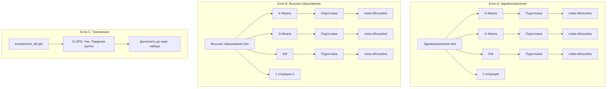

# Лабораторная работа №4 — «Кластерный анализ в Loginom»

Подробное объяснение схемы `bd_lr4.lgp`: что делает каждый блок, зачем он нужен и как читать результаты.

---

## 1. Зачем эта лабораторная

**Тема:** кластерный анализ (cluster analysis).

**Главная идея:** взять набор объектов (регионы России, чеки покупателей) и **разбить их на группы (кластеры)** так, чтобы внутри группы объекты были похожи друг на друга, а между группами — отличались.

Это **обучение без учителя**: заранее никто не говорит «этот регион — класс A». Алгоритм сам ищет структуру в данных.

**Что нужно сделать по заданию:**
1. Кластеризовать данные **здравоохранения** и **высшего образования** тремя алгоритмами: **K-Means**, **G-Means**, **EM**.
2. Сравнить качество разбиений (метрики, в т.ч. **коэффициент силуэта**).
3. Подобрать **оптимальное число кластеров k** (метод «локтя»).
4. Для файла **transactions_diy.lgd** применить **транзакционную кластеризацию CLOPE**.
5. Изучить, как алгоритмы ведут себя **по итерациям** (как меняется разбиение от шага к шагу).

---

## 2. Что такое схема в Loginom

Схема — это **конвейер обработки данных**:

```
Источник данных → Алгоритм кластеризации → Подготовка результата → Оценка качества
```

- **Узел** — один шаг (загрузка Excel, K-Means, расчёт силуэтов).
- **Стрелки** — поток данных: выход одного узла идёт на вход следующего.
- **Суперузлы** (кнопка «Войти») — маленькие под-схемы внутри узла. Например, `meta-silhouettes` и `1 итерация`.

Пакет `bd_lr4.lgp` использует библиотеки:
- **loginom_silver_kit** — утилиты (силуэты, сравнение кластеризаций и др.).
- **loginom_sklearn_meta** — Python-компоненты на базе scikit-learn (в т.ч. `meta-silhouettes`).

---

## 3. Общая карта схемы

На схеме **четыре больших блока**, которые работают параллельно:



| Блок | Источник | Алгоритмы | Зачем |
|------|----------|-----------|-------|
| A | Здравоохранение.xlsx | K-Means, G-Means, EM | Сравнение методов на мед. показателях регионов |
| B | Высшее образование.xlsx | K-Means, G-Means, EM | То же на показателях вузов |
| C | transactions_diy.lgd | CLOPE | Кластеризация «корзин покупок» |
| A, B (верх) | те же Excel | 1 итерация | Как меняется k-means/g-means за 1 шаг |

---

## 4. Входные данные

### 4.1. Здравоохранение.xlsx

**Объекты:** регионы России (строка = один регион).

**Признаки для кластеризации** (числовые столбцы, регион не участвует):
- мощность амбулаторно-поликлинических учреждений на 10 тыс. населения;
- численность населения на одну больничную койку;
- обеспеченность врачами на 10 тыс. человек;
- обеспеченность средним мед. персоналом на 10 тыс. человек.

**Смысл:** алгоритм группирует регионы с похожим уровнем развития здравоохранения.

### 4.2. Высшее образование.xlsx

**Объекты:** регионы.

**Признаки:**
1. число вузов и филиалов на 1 млн населения;
2. численность студентов (бакалавриат/специалитет/магистратура) на 10 тыс. населения;
3. приём на обучение на 10 тыс. населения;
4. выпуск на 10 тys. населения;
5. численность ППС на 1000 студентов.

**Смысл:** группировка регионов по «профилю» высшего образования.

### 4.3. transactions_diy.lgd

**Транзакционные данные** — не таблица «объект × признак», а **список покупок**:
- **Чек (BCode)** — идентификатор транзакции (корзина);
- **Клиент** — кто купил;
- **Товар** — что купили;
- **Товарная группа** — категория товара.

**Смысл:** найти типичные **наборы категорий**, которые часто покупают вместе (market basket / транзакционные кластеры).

---

## 5. Алгоритмы кластеризации — подробно

Ниже — суть каждого метода из схемы, плюсы и минусы и то, как это соотносится с вашей лабораторной.

### 5.1. K-Means (k-средних)

**Идея:** задано число кластеров **k**. Алгоритм ставит в пространстве признаков **k центров** и по очереди:

1. каждому объекту назначает **ближайший** центр (жёсткое членство: один объект — один кластер);
2. центр каждого кластера переносит в **центроид** (среднее по координатам) своих объектов.

Цикл повторяется, пока назначения почти перестанут меняться.

**Мера похожести:** главным образом **евклидово расстояние** до центра → получаются компактные «шарики» в метрике близости.

**Плюсы:**

- очень распространённый, понятный и обычно **быстрый** метод;
- хорош как **базовая линия** для сравнения с G-Means и EM.

**Минусы:**

- **k задаёте вы** заранее (в лабе его подбирают методом «локтя»);
- чувствителен к **начальной инициализации** центров и к **выбросам**;
- неявно предполагает, что кластеры **примерно круглые** и сопоставимы по масштабу; вытянутые или сильно перекрывающиеся облака может описать хуже.

**В вашей работе:** три параллельные ветки с Excel — одна из них всегда K-Means; удобно сравнивать с G-Means и EM по силуэту и по смыслу кластеров.

---

### 5.2. G-Means

**Идея:** развитие идеи K-Means. Обычно начинают с небольшого числа кластеров и **проверяют**, укладываются ли точки внутри кластера в одно «нормальное» облако. Если внутри кластера данные слишком «растянуты» или не похожи на один компонент, кластер **делят** (часто на два). Так постепенно **растёт число кластеров**, пока эвристика это оправдывает.

**На практическом уровне:** это способ **автоматически подобрать k** без ручного перебора всех вариантов (в отличие от классического K-Means с фиксированным k).

**Плюсы:**

- не нужно заранее жёстко фиксировать **k**;
- на ровных табличных данных часто даёт **осмысленное** число групп.

**Минусы:**

- может выдать **слишком много** или **слишком мелкие** кластери;
- опирается на статистическую проверку «один кластер = одно распределение» — на **шумных** реальных данных решение не всегда идеально.

**В вашей работе:** та же постановка, что у K-Means (числовые признаки регионов), но с другим подходом к числу кластеров — в отчёте часто сравнивают **силуэт** и интерпретацию групп (например, G-Means лучше отделяет регионы по образованию).

---

### 5.3. EM (Expectation–Maximization), чаще в связке со **смесью гауссианов** (GMM)

**Идея:** данные моделируют как **смесь k нормальных распределений** — у каждого кластера есть центр, форма облака (ковариация) и «вес» в смеси. У объекта нет одной жёсткой метки: есть **вероятности принадлежности** к каждому из k кластеров (мягкое членство).

**Шаги EM:**

- **E-step (ожидание):** по текущим параметрам кластеров пересчитывают вероятности «объект i принадлежит кластеру j»;
- **M-step (максимизация):** по этим вероятностям обновляют центры, разбросы и веса так, чтобы лучше объяснить данные.

**Плюсы:**

- кластеры могут быть **эллиптическими** и учитывать корреляции признаков (не только «шарики»);
- удобен, когда границы между группами **размыты** — регион «частично» похож на два профиля;
- в отчёте естественно смотреть **матрицу принадлежности** и параметры кластеров.

**Минусы:**

- **k снова задаёте вы** (как в K-Means, но интерпретация мягче);
- возможны **локальные оптимумы** — разные запуски могут чуть отличаться;
- на малых выборках и с сильными выбросами поведение может быть неустойчивым.

**В вашей работе:** третья ветка на тех же Excel; хорошо для обсуждения **перекрытия** кластеров и отличия от жёсткого K-Means.

---

### 5.4. CLOPE (транзакционная кластеризация)

**Идея:** данные не в виде «объект × числовой признак», а как **транзакции**: у чека есть **набор категорий / товарных групп**. CLOPE группирует транзакции (или связанные с ними сущности) так, чтобы чеки с **похожим составом набора категорий** попадали в один кластер. Это метод под **ритейл и анализ корзин**, а не замена K-Means на той же числовой таблице регионов.

**Плюсы:**

- заточен под **категориальные наборы** и совместную покупку категорий;
- в схеме: узел **«CLOPE: Чек, Товарная группа»** — чек и товарная группа задают роль транзакции и элемента набора.

**Минусы:**

- другая постановка задачи и другая интерпретация качества; **напрямую** не стоит сравнивать «только по силуэту» с веткой регионов — это отдельный блок схемы с `transactions_diy.lgd`.

**В вашей работе:** отдельная ветка после загрузки `.lgd`: типичные **профили корзин** (какие товарные группы часто идут вместе).

---

### 5.5. Сводная таблица

| Метод | Что задаёте вы | Тип данных | Жёсткое / мягкое членство | Кратко |
|-------|----------------|------------|---------------------------|--------|
| **K-Means** | **k** | числовые признаки | жёсткое | Центроиды, быстрая база |
| **G-Means** | обычно не **k** (подбирается) | числовые | жёсткое | Авто-усложнение числа групп |
| **EM (GMM)** | **k** | числовые | мягкое (вероятности) | Эллипсы, перекрытие кластеров |
| **CLOPE** | параметры модели (в т.ч. роли полей) | транзакции, наборы категорий | своя логика | Профили «корзин» |

---

## 6. Что происходит после кластеризации (средняя часть схемы)

После K-Means / G-Means / EM у каждого объекта появляется столбец **«Номер кластера»** (0, 1, 2, …).

Дальше идут узлы подготовки:

| Узел | Что делает |
|------|------------|
| **Удаление, Изменение** / **Удаление** | Убирает лишние столбцы, оставляет нужные для оценки (номер кластера + признаки или только метки). |
| **Номер кластера** | Явно выделяет/переименовывает столбец с меткой кластера для следующих шагов. |
| **meta-silhouettes** | Суперузел: считает **коэффициент силуэта** для каждого объекта и сводные метрики (через Python/sklearn). |

### Что такое коэффициент силуэта

Для каждого объекта измеряется:
- насколько он **близок к своему** кластеру;
- насколько он **далёк от чужих** кластеров.

**Интерпретация:**
- близко к **+1** — объект хорошо «сел» в свой кластер;
- около **0** — на границе между кластерами;
- близко к **−1** — объект, скорее всего, в неправильном кластере.

**Средний силуэт по всем объектам** — главная цифра для **сравнения алгоритмов**: чем выше, тем лучше разбиение.

> В отчёте по лабе для образования часто получается, что **G-Means** даёт лучший силуэт (~0,43), чем K-Means.

---

## 7. Блок «1 итерация» (верх схемы)

Суперузлы **«1 итерация»** и **«1 итерация-1»** (для здравоохранения и образования) — это **эксперимент с одним шагом** алгоритма.

**Зачем:** посмотреть, как меняется разбиение **не до полной сходимости**, а после **одной итерации** K-Means/G-Means.

Внутри обычно:
- переменная **«Текущая итерация»**;
- узел **«В столбцы: Текущая итерация (+1)»** — записывает номер шага;
- **«Число кластеров, Итераций осталось, Текущая итерация»** — служебная логика цикла;
- **«1 итерация (постусловие)»** — проверка/остановка после одного прохода.

**Смысл для отчёта:** показать, что кластеризация — **итеративный процесс**: центры смещаются, объекты перераспределяются, метрики улучшаются (или стабилизируются).

---

## 8. Блок CLOPE (низ схемы)

```
transactions_diy.lgd → CLOPE: Чек, Товарная группа → Дополнять до макс. набора
```

1. **transactions_diy.lgd** — загрузка транзакций (~24 МБ, много чеков).
2. **CLOPE** — строит кластеры **чеков** по **товарным группам** в корзине.
3. **Дополнять до макс. набора** — приводит результат к единому формату набора (все строки/столбцы для дальнейшего анализа или отчёта).

**Пример интерпретации кластера:** «чеки, где часто вместе покупают молочные продукты и хлеб» vs «чеки с электроникой и аксессуарами».

---

## 9. Метод «локтя» (из отчёта)

Для **K-Means** число k **неизвестно заранее**. Метод локтя:

1. Запустить K-Means для k = 1, 2, 3, 4, …
2. Для каждого k посмотреть **внутрикластерную ошибку** (насколько объекты далеко от центров).
3. Построить график k → ошибка.
4. Искать «**локоть**» — место, где падение ошибки резко замедляется.

**Оптимальное k** — обычно **3 или 4** (как в вашем отчёте): дальше добавление кластеров почти не улучшает качество.

---

## 10. Как читать результаты по алгоритмам (из вашего отчёта)

### Здравоохранение + K-Means / G-Means

- Регионы делятся на несколько групп по уровню мед. обеспеченности.
- **G-Means** для здравоохранения часто даёт **более осмысленное** разбиение (лучше отделяет «сильные» и «слабые» регионы).
- Силуэт ~**0,43** — умеренно хорошее качество (данные реальные, не идеальные).

### Высшее образование

- Кластеры отражают разный масштаб системы высшего образования в регионе.
- **K-Means** может «рвать» похожие регионы из-за фиксированного k.
- **G-Means** часто выигрывает по силуэту на этом наборе.

### EM-кластеризация

- Даёт **«мягкие»** границы: регион может частично относиться к двум кластерам.
- В отчёте смотрят **матрицу принадлежности** и **центры/доли** по кластерам.
- EM полезен, когда кластеры **перекрываются** (переходные регионы).

### CLOPE на транзакциях

- Кластеры = **типы покупательского поведения**, а не «типы клиентов» напрямую.
- Параметр качества другой (не силуэт в классическом виде) — смотрите **прибыль/компактность** кластеров в настройках CLOPE.
- В отчёте описывают **размер кластеров** и **характерные товарные группы**.

---

## 11. Типичные кластеры (как описывать в отчёте)

После запуска откройте таблицу с **номером кластера** и исходными признаками. Для каждого кластера посчитайте **средние** по признакам:

**Пример для здравоохранения:**

| Кластер | Характеристика (словами) |
|---------|--------------------------|
| 0 | Высокая обеспеченность врачами и коеками |
| 1 | Средний уровень |
| 2 | Низкие показатели амбulatorной помощи |
| 3 | … |

Так же для образования: «много вузов и студентов», «мало вузов, но высокий выпуск» и т.д.

---

## 12. Пошагово: что происходит при запуске всей схемы

1. Loginom загружает **3 источника** (2 Excel + 1 lgd).
2. Каждый Excel идёт в **3 параллельные ветки** (K-Means, G-Means, EM) → **6 веток** всего.
3. В каждой ветке: алгоритм → очистка столбцов → **meta-silhouettes** → таблица с оценкой.
4. Параллельно Excel идут в **1 итерация** — демонстрация одного шага.
5. Транзакции идут в **CLOPE** → постобработка.
6. Вы сравниваете **силуэты**, **число кластеров**, **состав регионов** в отчёте.

---

## 13. Что говорить на защите (краткий конспект)

1. **Задача:** без учителя разбить регионы/транзакции на группы.
2. **Данные:** 2 таблицы Росстата по регионам + транзакции DIY-магазина.
3. **Методы:** K-Means (фиксированное k), G-Means (авто-k), EM (вероятностная модель), CLOPE (транзакции).
4. **Оценка:** силуэт + метод локтя для выбора k.
5. **Вывод:** какой алгоритм лучше на каких данных и почему (G-Means на образовании, EM где есть перекрытие, CLOPE для корзин).

---

## 14. Связь файлов в папке лабы

| Файл | Назначение |
|------|------------|
| `bd_lr4.lgp` | Основная схема (то, что на скриншоте) |
| `Здравоохранение.xlsx` | Данные для блока A |
| `Высшее образование.xlsx` | Данные для блока B |
| `transactions_diy.lgd` | Транзакции для CLOPE |
| `Сравнение кластеризаций.xlsx` | Таблицы для отчёта (если заполнена) |
| `Среднее образование.xlsx` | Доп. материалы |
| `libs/` | Библиотеки Loginom (silver_kit, sklearn_meta) |
| `ЛР_ЛР4.docx` / `.pdf` | Готовый отчёт с таблицами и выводами |

---

## 15. Частые вопросы

**Почему три одинаковых «meta-silhouettes»?**  
Один на каждую комбинацию «датасет + алгоритм». Сравниваете качество разбиений между собой.

**Почему нужен Python/sklearn?**  
Компонент `meta-silhouettes` из `loginom_sklearn_meta` вызывает scikit-learn для расчёта силуэтов.

**Почему «Номер кластера» и «Удаление»?**  
Чтобы в оценку качества попали только нужные столбцы: метки кластеров и признаки в правильном формате.

**Чем CLOPE отличается от K-Means?**  
K-Means — для **числовых** признаков объектов. CLOPE — для **категориальных транзакций** («что с чем покупают»).

---

*Документ создан для понимания схемы `bd_lr4.lgp`. Откройте узлы с кнопкой «Войти», чтобы увидеть внутреннюю логику суперузлов.*
